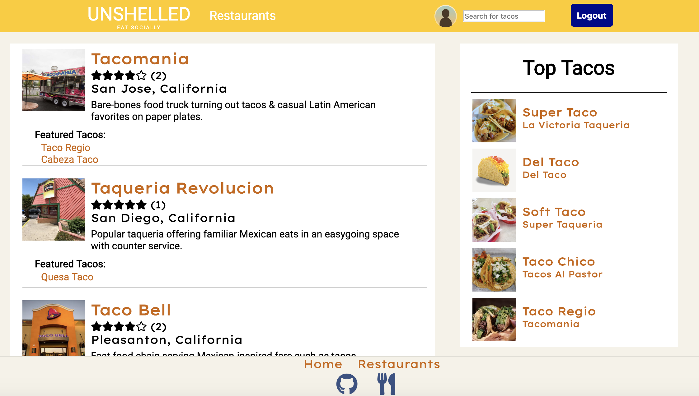
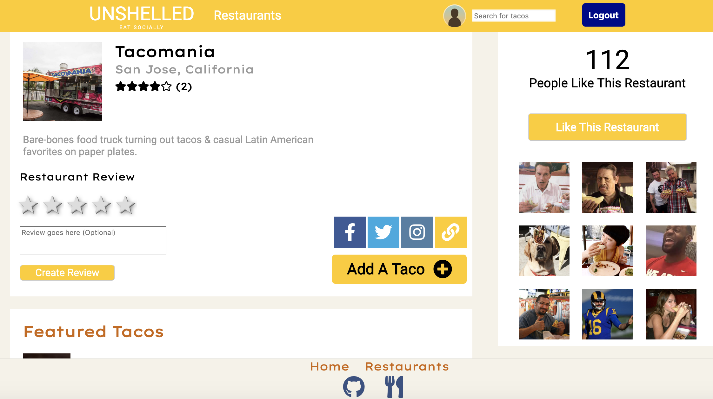
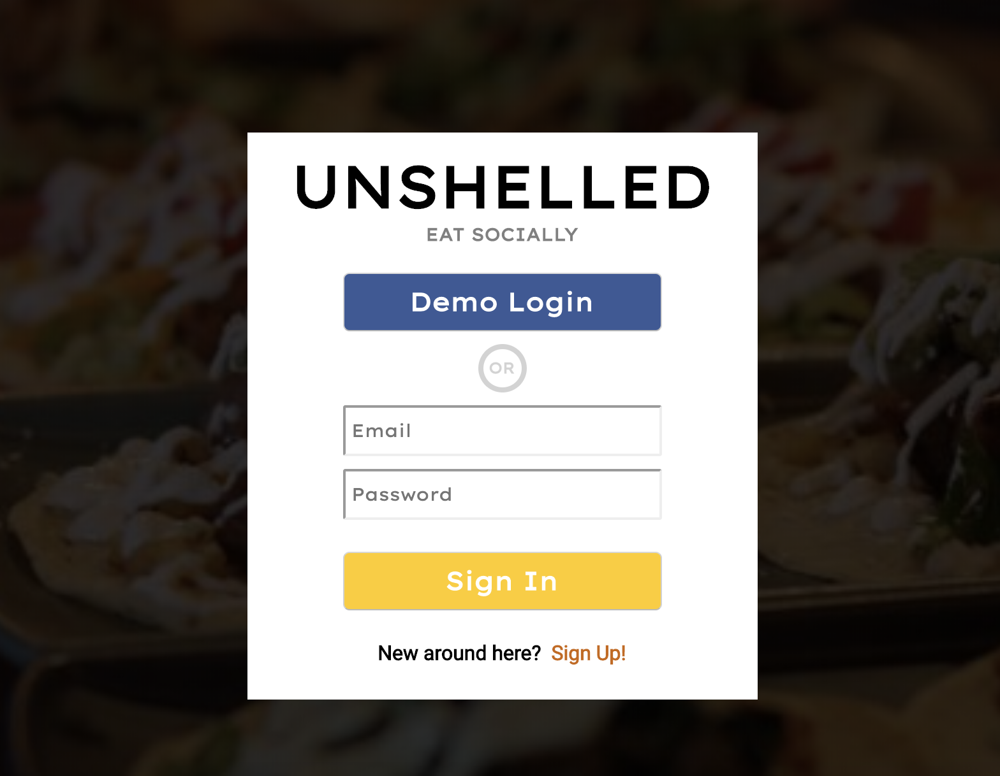

# Unshelled
Unshelled is a web application focuses on helping it's users find the best taco's in their area. Unshelled is inspired from the popular site [Untapped](https://untappd.com). User's are able to search for resturants in their area that serve tacos. User's are also able to review the tacos, leave reviews, and check-in to show others where they have been!
test

## Team Members
- Cameron Giles
- Clayton Jones
- Kevin Le
- Leap Soto

## MVP's
- Drinks CRUD
- Checkins / reviews
- Review feed
- Profile
- Bonus: Friendships
- Bonus: Search
- Bonus: Venues
- Bonus: Badges

## Technologies

- MongoDB
- React
- GraphQL
- AWS S3
- Docker
- Heroku Container Registry

## Backup Idea
- Eventbrite
- Wufoo

## Weekend Plan

- User Auth - 2 people
- Backend Model - 2 people
